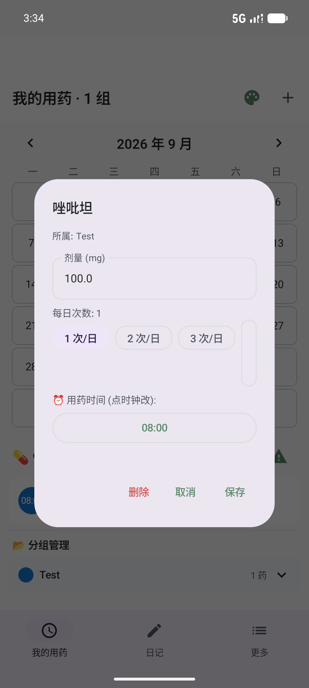
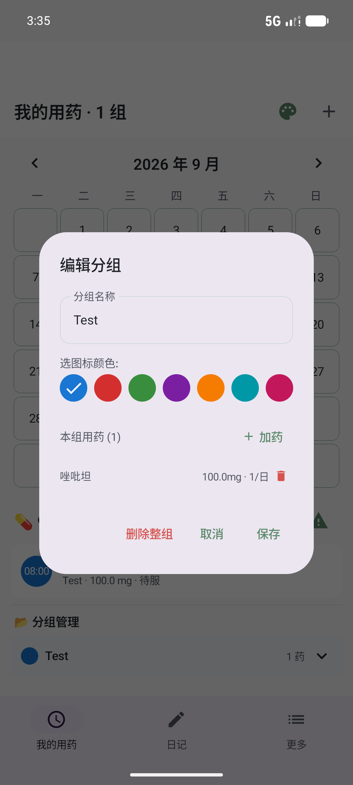
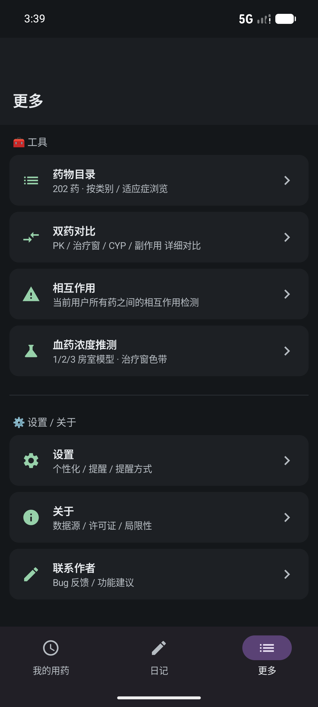

# DoseCare

> **本地优先、端侧加密、为精神疾病和慢性病共病人群设计的多药用药管理 App。**
> Local-first, end-to-side-encrypted, polypharmacy management for psychiatric and chronic-disease comorbidity.

**中文名：慎药 (shèn yào) — "谨慎用药"的双关，对医嘱+用户双向提醒。**
**包名 `com.dosecare.app` · AGPL-3.0**

---

## v0.8d 已实现功能 (Latest)

### 🎨 主题 & 个性化 (v0.8c → v0.8d)
- **5 个预设主题色** — 浅蓝 / 暖橙 / 墨绿 / 玫瑰红 / 深紫
- **自定义调色盘 (v0.8d 新增)** — HSV 圆盘 + Hue/Value 滑块 + HEX 输入,任意颜色实时派生 light/dark palette
- **3 种主题模式** — 跟随系统 / 亮色 / 暗色
- **圆角加大** — 全局 12/14/18/24/32 dp (v0.8c)
- **持久化** — SharedPreferences,重启 App 自动恢复

<p align="center">
  
  
  
</p>

### 📅 用药计划 (Calendar Tab · v0.8b/c)
- **3-tab 底部导航** — 我的用药 / 日记 / 更多 (v0.8a)
- **月历视图** — 跨 tab 共享,日期方块点击切换
- **PlanRow 多 slot 用药时间** — 一药多次/日,每行展开可看
- **PlanRow 打卡** — 点 08:00 圆点弹"打卡·药名"dialog,可改时间
- **中文药名显示 (v0.8b fix)** — 查 `catalog.genericNameZh`,不再是英文 drugId
- **可滚动布局 (v0.8b fix)** — LazyColumn → Column + verticalScroll

<p align="center">
  
  
</p>

### ✏️ 药 & 分组编辑 (v0.8b/c)
- **长按 PlanRow → EditDrugDialog** — 改 freq / times / dose / 删除药 / 撤销打卡
- **长按 分组 → EditGroupDialog** — 改名称 / 颜色 / 组内用药管理 / 删除整组
- **嵌套 AddDrugDialog** — 在 EditGroupDialog 内点"+ 加药",自动归属当前组

<p align="center">
  
  
</p>

### 💊 临时用药 (v0.8b)
- **+ BottomSheet 3 选项** — 新建分组 / **临时用药** / 为已有分组加药
- **自动创建/复用"临时用药"组** (橙 #F57C00)
- **targetDate 字段** — 单次记录,不属于任何常规分组(头痛药/助眠药/抗生素短程)

<p align="center">
  
</p>

### 📔 心情日记 (v0.8a)
- **月历视图** — 跟用药 tab 共享日历组件
- **6 种心情标签** — 极好 / 良好 / 一般 / 较差 / 糟糕 / 危机
- **+ 写日记** — 选 mood + 文本记录,自动绑定日期

<p align="center">
  
</p>

### 🔧 工具集 (更多 tab)
- **💊 药物目录** — 202 药 · 按类别 / 适应症浏览(31 药理学分类 / 42 适应症)
- **⚖️ 双药对比** — PK / 治疗窗 / CYP / 副作用 详细对比
- **⚠️ 相互作用** — 当前用户所有药之间的相互作用检测(202 药全库 5 维搜索)
- **🧪 血药浓度推测 (TDM)** — 1/2/3 房室模型 · 治疗窗色带
- **⚙️ 设置 / 关于 / 联系作者** — 偏好 + 项目信息

<p align="center">
  
  
  
</p>
<p align="center">
  
  
  
</p>

### ℹ️ 关于 & 联系 (v0.8d 增强)
- **🔗 仓库源代码 (v0.8d 新增)** — 跳转到 GitHub 仓库,README/CHANGELOG/CONTRIBUTING 都在仓库根目录
- **💌 联系作者 (v0.8d 新增)** — `mailto:daisukikiki01@gmail.com` 一键发邮件
- **📜 开源许可证** — GNU AGPL-3.0 全文
- **📚 数据源** — AGNP 2017 + FDA DailyMed + Flockhart CYP Table
- **⚠️ 局限性** — 1 房室模型偏差、实际浓度受 CYP/肝肾/食物影响,不替代医师面诊

<p align="center">
  
  
</p>

### 🔍 药物搜索 (v0.8b)
- **5 维匹配** — 中文名 / 英文名 / 品牌 / ATC 分类 / 拼音首字母
- **拼音首字母** — "ZZT" 直接搜 "唑吡坦","ASPL" 搜 "阿司匹林"

---

## 它解决什么

精神疾病患者（精神分裂症、双相、抑郁、焦虑）长期服药常常伴随：

- **多药共用 (polypharmacy)** — 同时吃 3-5 种精神类药很常见
- **代谢综合征共病** — 抗精神病药长期使用 → 糖尿病/血脂异常/肥胖
- **严重药物相互作用** — CYP450 介导的代谢抑制/诱导,致命案例真实存在

普通用药提醒 App 只能"到点响铃"。**DoseCare** 做的是：

1. **追踪血药浓度** — 用一房室/三房室 PK 模型估算当前浓度,叠加显示治疗窗
2. **代谢路径可视化** — CYP3A4 / 2D6 / 1A2 / 2C19 / 2C9 五大酶的底物-抑制剂-诱导剂图谱
3. **冲突检测** — 规则引擎扫描当前用药组合,按**严重度分级**输出相互作用清单
4. **多药对比** — 并排视图,让患者/家属/医生快速看到"换药前后 PK 差异"
5. **依从性日历 + 心情日记** — 月历视图,服药打卡 + 6 种心情标签
6. **未来扩展** — 内分泌共病、医生端、加密同步、跨端

## 核心设计原则

| 原则 | 落地 |
|------|------|
| **离线优先** | 所有数据本地存储;PK 计算不联网;冲突检测本地规则引擎 |
| **端侧加密** | SQLCipher 加密 Room 数据库,密钥存 Android Keystore |
| **零账号零遥测** | 不要求注册;网络仅在用户**主动开启**时启用 |
| **可解释** | 任何 PK 估算、冲突告警都给出"为什么"和数据出处 |
| **医疗免责声明** | 所有计算结果仅供参考,实际用药遵医嘱 |

## 模块状态

| 模块 | 状态 | 备注 |
|------|------|------|
| 药物目录 (DrugCatalog) | ✅ 202 药 | 涵盖精神科 / 内分泌 / 心血管 / 抗癫痫 / 止痛等 |
| PK 引擎 (一房室/三房室) | ✅ | RK4 数值积分,单位换算 (mg/L ↔ ng/mL) |
| 规则引擎 (CYP/QTc/抗胆碱/5-HT) | ✅ | 400+ 行自研引擎 |
| TDM 多药曲线 | ✅ | 跨单位治疗窗叠加 + 剂量调整建议 |
| Room + SQLCipher 加密栈 | ✅ v0.7 | 11 静态表 + 7 用户表,version=4 |
| 3-tab 大重构 (Calendar / Diary / More) | ✅ v0.8a | 月历跨 tab 共享,多 slot 用药时间 |
| 拼音首字母搜索 | ✅ v0.8b | 中文 / 英文 / 品牌 / ATC / 拼音首字母 五维 |
| UI 主题 (5 预设 + 自定义调色) | ✅ v0.8c/d | 圆角加大 12/14/18/24/32,主题持久化 |
| 长按药/分组 → 编辑 | ✅ v0.8b | EditDrugDialog + EditGroupDialog |
| 临时用药 | ✅ v0.8b | 单次记录,自动建/复用「临时用药」组 |
| 关于页增强 (mailto + 仓库 URL) | ✅ v0.8d | `daisukikiki01@gmail.com` + `github.com/sakanana001/dosecare` |
| 提醒 (WorkManager + 通知) | 🔜 v0.8c | schema 已预埋 (`dose_taken` 表) |
| 加密云同步 | 🔮 v2.0 | 详见 `docs/08-SYNC_ACCOUNT_FUTURE.md` |

## 技术栈

| 类别 | 选型 | 版本 |
|------|------|------|
| 平台 | Android | minSdk 26, targetSdk 36 |
| 语言 | Kotlin | 2.2.10 |
| UI | Jetpack Compose + Material 3 | BOM 2024.10.01 |
| 架构 | Clean Architecture | domain / data / ui 三层 |
| 数据库 | Room | 2.7.0 |
| 加密 | SQLCipher (新 artifact) | 4.6.1 |
| DI | Hilt | 2.59.2 |
| 注解处理 | KSP | 2.2.10-2.0.2 |
| 序列化 | kotlinx.serialization | 1.7.3 |
| 协程 | kotlinx-coroutines | 1.9.0 |
| 后台 | WorkManager (提醒, 待接 UI) | 2.9.1 |
| 构建 | AGP | 9.2.1 |
| Gradle | Gradle | 9.4.1 |

## 项目结构

```
.
├── app/                      # Android 主模块
│   ├── src/main/java/com/dosecare/app/
│   │   ├── domain/           # 纯 Kotlin 领域层 (PK 引擎 / 规则引擎 / 目录)
│   │   │   ├── catalog/      # 药物目录加载 + CYP 谱
│   │   │   ├── pk/           # PK 模型 + 引擎
│   │   │   ├── rules/        # 规则引擎 (相互作用)
│   │   │   ├── prescription/ # 处方领域模型 (含 targetDate 临时用药字段)
│   │   │   ├── repository/   # Repository 接口 (KMP-ready)
│   │   │   └── patient/      # 患者画像 (剂量调整)
│   │   ├── data/             # 数据层
│   │   │   ├── db/           # Room 实体 + DAO + DataSeeder
│   │   │   ├── repository/   # Repository 实现 (Diary / Prescription / Catalog)
│   │   │   ├── crypto/       # DbKeyProvider (Keystore 派生 passphrase)
│   │   │   └── migration/    # v0.6 JSON → v0.7 Room 数据迁移
│   │   ├── di/               # Hilt 模块 (Database / Catalog 绑定)
│   │   ├── ui/               # Compose UI 层
│   │   │   ├── theme/        # 主题 (Color + Shape + Type + ThemeController)
│   │   │   │                #   5 预设 + 派生算法 + SharedPreferences 持久化
│   │   │   ├── CalendarTab.kt, DiaryTab.kt, BottomNavTabs.kt
│   │   │   ├── SearchableDrugPicker.kt  # 5 维搜索
│   │   │   ├── InteractiveConcentrationChart.kt
│   │   │   ├── ColorPickerDialog.kt  # v0.8d 新增 - HSV 调色盘
│   │   │   └── ...           # 详情 / 对比 / 相互作用 / TDM / InfoScreens
│   │   ├── DoseCareApp.kt    # @HiltAndroidApp
│   │   └── MainActivity.kt   # 唯一 Activity
│   ├── src/main/assets/drugs/ # 内置目录 JSON (v0.6.json 880KB, 202 药)
│   └── src/test/             # JUnit 单元测试 (DrugCatalogLoader / 规则引擎)
├── docs/                     # 设计文档 + 截图 + branding
│   ├── 00-VISION.md ... 08-SYNC_ACCOUNT_FUTURE.md
│   ├── branding/             # Logo 文件 (adaptive icon 5 density)
│   ├── screenshots/v0.8b/    # README 引用的所有截图
│   └── ui-dumps/v0.8b/       # uiautomator dump 调试用 (zip exclude)
├── desktop-archive/          # (开发期产物归档,zip exclude)
├── prototype/                # 早期领域层原型 (Kotlin lib)
├── scripts/                  # 数据生成 + 校验脚本 + 打包脚本
├── gradle/libs.versions.toml # 版本目录
├── LICENSE                   # AGPL-3.0
└── README.md (本文件)
```

## 构建

### 环境要求

- JDK 17 (`JAVA_HOME` 指向 JDK 17)
- Android SDK (compileSdk 36, build-tools 36)
- Gradle wrapper (项目自带,9.x)

### 调试构建

```bash
# 克隆
git clone https://github.com/sakanana001/dosecare.git
cd dosecare

# 编辑 local.properties (SDK 路径)
echo "sdk.dir=/path/to/Android/Sdk" > local.properties

# 构建 debug APK
./gradlew :app:assembleDebug

# 安装到连接的设备
./gradlew :app:installDebug
# 或手动
adb install -r app/build/outputs/apk/debug/app-debug.apk
```

### 单元测试

```bash
./gradlew :app:testDebugUnitTest
```

测试覆盖：
- `DrugCatalogLoaderTest` — 真实加载 `test/resources/drugs/v0.6.json` (508KB)
- `PkCalibrationTest` — PK 模型数值积分正确性
- `RuleEngineSmokeTest` — 规则引擎 (CYP 抑制/诱导、QTc 累积)
- `LorazepamCheckTest` — 关键药 5 维匹配
- `PrimaryPathwayTest` — 主代谢路径断言

## 数据模型 (Room v4)

### 11 张静态表 (DrugCatalog 灌库)

| 表 | 用途 |
|----|------|
| `drug` | 药物主表 (id / genericName / category / atc) |
| `drug_brand` | 品牌名 |
| `drug_indication` | 适应症 |
| `drug_active_metabolite` | 活性代谢物 |
| `drug_pk` | PK 参数 (ke / Vd / F / t½) |
| `drug_therapeutic_window` | 治疗窗 (跨单位) |
| `drug_overdose` | 中毒症状 + 处理 |
| `drug_clinical` | 临床要点 |
| `cyp_role` | CYP 底物/抑制剂/诱导剂谱 |
| `drug_critical_interaction` | 严重相互作用 |
| `app_metadata` | 灌库版本号 |

### 7 张用户表

| 表 | 用途 |
|----|------|
| `prescription_group` | 处方分组 (按"早/中/晚"或"症状发作时") |
| `prescribed_drug` | 处方内具体药 (含 `times: List<String>` 多 slot 时间 + `targetDate: Long?` 临时用药日期) |
| `dose_taken` | 打卡记录 (timestamp 校准) |
| `tdm_history` | 血药浓度历史 (TDM 校准) |
| `lab_result` | 化验结果 (肾/肝/血糖/血脂) |
| `user_preference` | 用户偏好 |
| `diary_entry` | 心情日记 (6 种 mood) |

详见 [`docs/02-DATA_MODEL.md`](docs/02-DATA_MODEL.md)。

## 加密模型

- **数据库加密**：Room over SQLCipher (256-bit AES)
- **密钥派生**：首次启动时 `SecureRandom` 生成 32 字节 passphrase → 存 EncryptedSharedPreferences (AES256_GCM, key wrapped by Android Keystore)
- **不开网络时**：所有数据永远不出设备
- **备份**：`allowBackup="false"` (AndroidManifest 强制),用户必须手动 export

详见 [`SECURITY.md`](SECURITY.md)。

## 文档地图

| 文档 | 内容 |
|------|------|
| [docs/00-VISION.md](docs/00-VISION.md) | 产品愿景与目标用户画像 |
| [docs/01-ARCHITECTURE.md](docs/01-ARCHITECTURE.md) | 三层架构、模块边界、依赖规则 |
| [docs/02-DATA_MODEL.md](docs/02-DATA_MODEL.md) | Room schema + DrugCatalog JSON 模式 |
| [docs/03-PK_ENGINE.md](docs/03-PK_ENGINE.md) | PK 模型选择、数值积分、多药叠加 |
| [docs/04-RULE_ENGINE.md](docs/04-RULE_ENGINE.md) | 规则分类、严重度分级、引擎设计 |
| [docs/05-DRUG_CATALOG.md](docs/05-DRUG_CATALOG.md) | 药物目录设计、数据源、采集流水线 |
| [docs/06-UI_DESIGN.md](docs/06-UI_DESIGN.md) | 极简主屏、对比页、依从性、PK 曲线 |
| [docs/07-ROADMAP.md](docs/07-ROADMAP.md) | v0.1 → v2.0 路线图与里程碑 |
| [docs/08-SYNC_ACCOUNT_FUTURE.md](docs/08-SYNC_ACCOUNT_FUTURE.md) | 联网、账号、医生端预留接口设计 |
| [docs/P1-01-ROOM-SQLCIPHER.md](docs/P1-01-ROOM-SQLCIPHER.md) | v0.7 数据库栈重构决策记录 |
| [docs/SETUP.md](docs/SETUP.md) | 开发环境搭建 |

## 路线图

| 版本 | 状态 | 关键能力 |
|------|------|----------|
| v0.1-v0.5 | ✅ | 20→200 药、PK 引擎、规则引擎、对比页、内分泌/心血管 |
| v0.6 | ✅ | DrugCatalog JSON v0.6 (202 药) + 跨单位治疗窗 |
| v0.7 | ✅ | **Room + SQLCipher 加密栈** + Hilt + KSP |
| v0.8a | ✅ | **3-tab 月历重构** (Calendar / Diary / More) + 心情日记 |
| v0.8b | ✅ | **拼音搜索** + **UI 主题升级** + **多 slot 用药时间** + **长按编辑** + **临时用药** |
| v0.8c | ✅ | **主题持久化** (圆角 12/14/18/24/32,3 模式 + 5 预设) |
| v0.8d | ✅ | **自定义调色盘** (HSV 圆盘) + **关于页仓库/联系增强** |
| v0.9 | 🔜 | **WorkManager 提醒** + 系统日历写入 + 通知权限 |
| v1.0 | 📋 | 完整功能、UI 打磨、性能优化、可访问性、隐私政策上线 |
| v1.5 | 📋 | KMP 抽离 domain 层,iOS 端骨架 |
| v2.0 | 📋 | 联网同步、账号、E2E 加密、医生端 |

详见 [`docs/07-ROADMAP.md`](docs/07-ROADMAP.md)。

## 已知问题

- **JUnit 在中文项目路径下**：当前项目路径 `精品神药` 含中文,Gradle worker JVM 把 `gradle-worker-classpath.txt` 读成 GBK 乱码 → `ClassNotFoundException`。**Production code 完全正常** (emulator 验证全过)。修复方案：项目挪到非中文路径,或 `GRADLE_OPTS="-Dfile.encoding=UTF-8 -Dsun.jnu.encoding=UTF-8"`。
- **WorkManager 提醒未接 UI**：schema 已就位 (DoseTaken 有 timestamp + note 字段),v0.9 接入。
- **日历事件点实时刷新**：当前 `dayEvents` 在 `LaunchedEffect(currentMonth)` 一次性灌入,保存日记/打卡后不会立即反映到日历格点(切月即可刷新)。

## 贡献

详见 [`CONTRIBUTING.md`](CONTRIBUTING.md)。

简版：
1. Fork 仓库
2. 创建 feature 分支 (`git checkout -b feature/xxx`)
3. 跑通 `./gradlew :app:testDebugUnitTest`
4. 提 PR,描述动机 + 测试方法

## 安全问题

请**不要**在 GitHub Issues 报告安全漏洞。详见 [`SECURITY.md`](SECURITY.md) 的私密报告流程。

## 许可

**AGPL-3.0-or-later**。详见 [`LICENSE`](LICENSE)。

选用 AGPL-3.0 的理由：未来医院私有部署时,AGPL 能保证"医院修改的功能必须回馈开源社区",避免"用户贡献的临床药师规则被某个医院私有化"。

若需要更宽松条款(与医院签商业 License),可在商用谈判中按 AGPL §13 协商。
