# DoseCare

> **本地优先、端侧加密、为精神疾病和慢性病共病人群设计的多药用药管理 App。**
> Local-first, end-to-side-encrypted, polypharmacy management for psychiatric and chronic-disease comorbidity.

**中文名：慎药 (shèn yào) — "谨慎用药"的双关，对医嘱+用户双向提醒。**
**包名 `com.dosecare.app` · AGPL-3.0 · Latest v0.9e**

[📥 下载 v0.9e APK](https://github.com/sakanana001/dosecare/releases/latest) · [📋 完整更新历史](#更新历史) · [🗺️ 产品路线图](#路线图)

---

## App 主要功能

### 1. 用药计划 + 打卡

- **3-tab 底部导航** — 我的用药 / 日记 / 更多
- **月历视图** — 跨 tab 共享,日期方块点击切换
- **多 slot 用药时间** — 一药多次/日,每行展开可看
- **打卡对话框** — 点时间圆点弹"打卡·药名",可改实际时间
- **长按编辑** — 改频次 / 时间 / 剂量 / 删除药 / 撤销打卡
- **临时用药** — 单次记录,自动建/复用「临时用药」组 (橙 #F57C00)

<p align="center">
  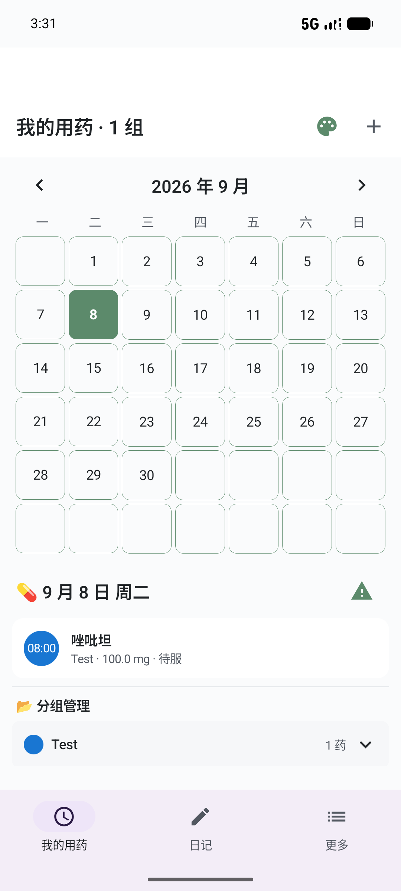
  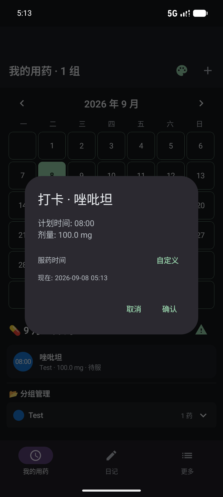
  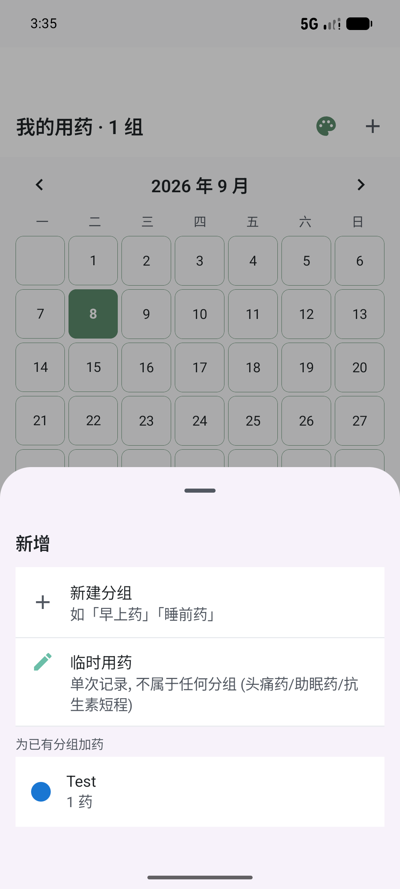
</p>

### 2. 心情日记 (v0.8a)

- **6 种心情标签** — 极好 / 良好 / 一般 / 较差 / 糟糕 / 危机
- **+ 写日记** — 选 mood + 文本记录,自动绑定日期

<p align="center">
  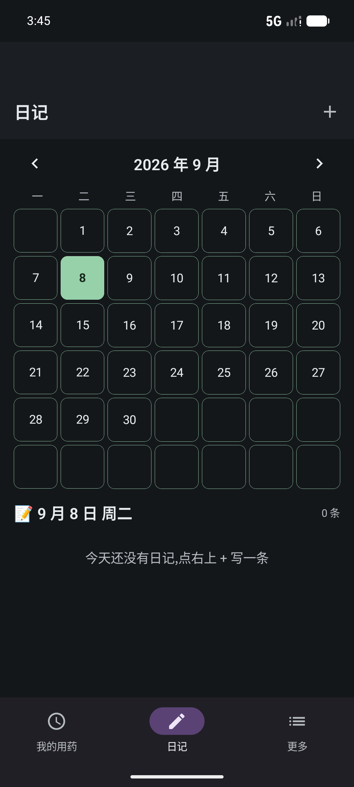
</p>

### 3. 药物目录 + 双药对比 (更多 tab)

- **202 药 · 按类别 / 适应症浏览** (31 药理学分类 / 42 适应症)
- **5 维搜索** — 中文名 / 英文名 / 品牌 / ATC 分类 / 拼音首字母
- **双药对比** — PK / 治疗窗 / CYP / 副作用 详细对比
- **DrugDetail** — 7 大 section (CYP 角色 / PK 估算 / 药理作用 / 关键不良反应 / 药物过量 / 剂量调整 / 监测要求) + 通俗解释 (Plain.kt 23 函数)

<p align="center">
  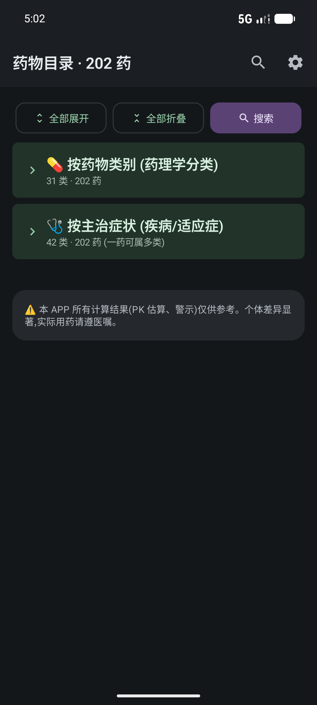
  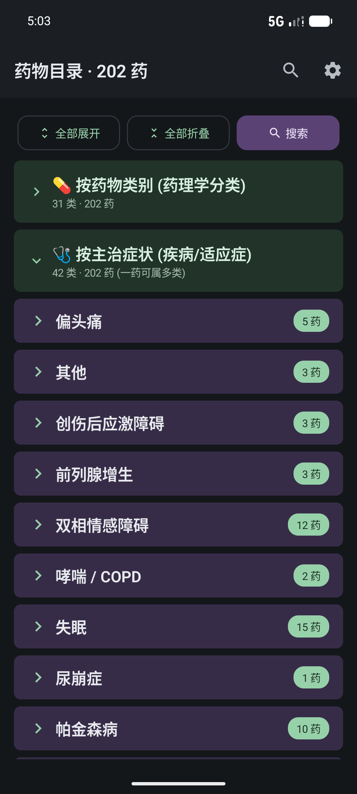
  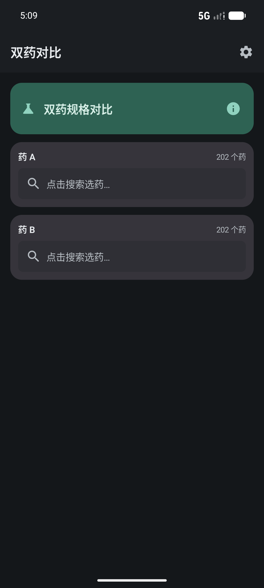
</p>

### 4. 血药浓度推测 (TDM)

- **1/2/3 房室模型** — RK4 数值积分
- **治疗窗色带** — 跨单位叠加 (mg/L ↔ ng/mL)
- **多药曲线** — 浓度叠加显示

<p align="center">
  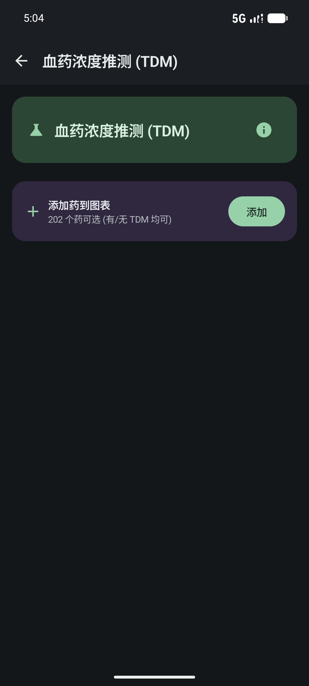
</p>

### 5. 相互作用检测 (规则引擎)

- **当前用户所有药** 自动两两组合 (N×(N-1)/2 对)
- **6 类规则** — CYP 抑制/诱导、QTc 累积、抗胆碱能、5-HT 综合征、治疗窗偏离、肾/肝剂量调整
- **严重度分级** — LOW / MEDIUM / HIGH / CONTRAINDICATED

<p align="center">
  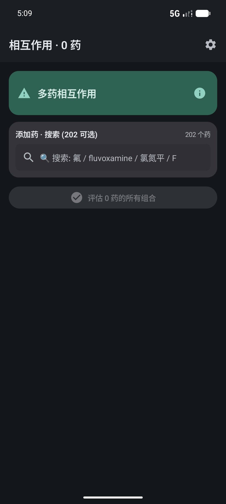
</p>

### 6. 主题 & 个性化

- **5 个预设主题色** — 浅蓝 / 暖橙 / 墨绿 / 玫瑰红 / 深紫
- **自定义调色盘** — HSV 圆盘 + Hue/Value 滑块 + HEX 输入
- **3 种主题模式** — 跟随系统 / 亮色 / 暗色
- **圆角加大** — 12/14/18/24/32 dp
- **持久化** — 重启 App 自动恢复

<p align="center">
  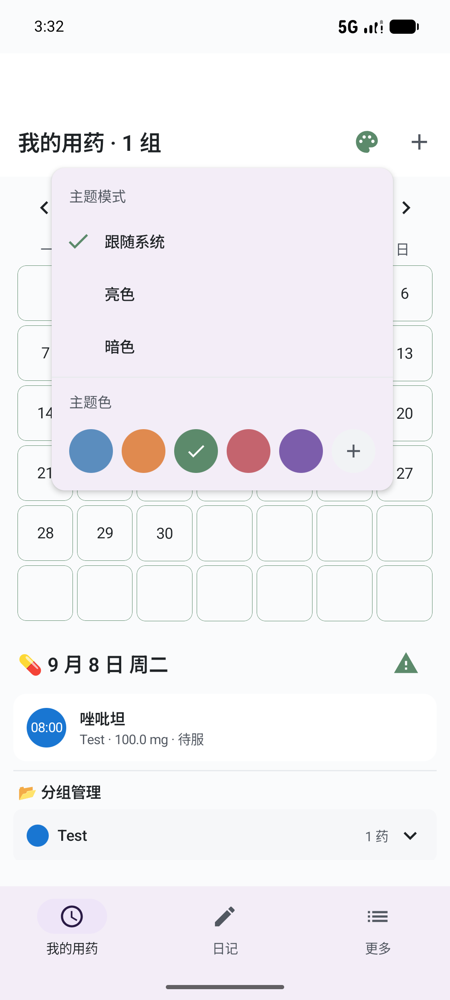
  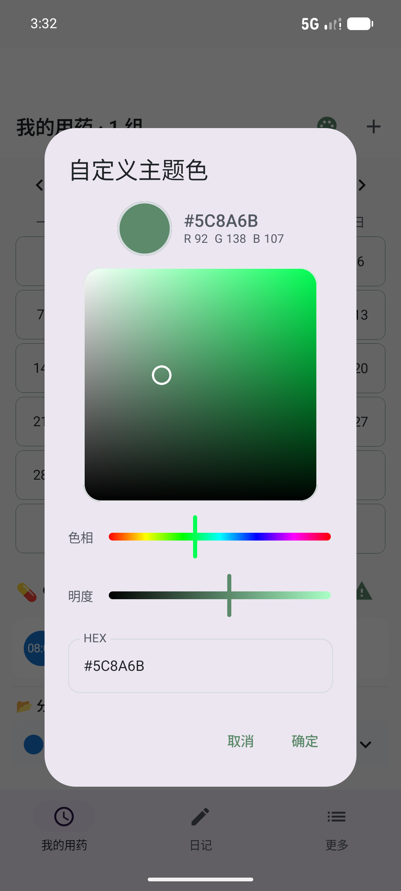
  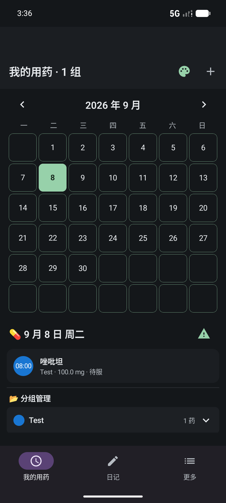
</p>

### 7. 多语言 (v0.9a-e) 🌐

- **3 种语言** — 简体中文 / English / 日本語
- **3 语言 532 key 100% 对齐** — UI 全部本地化,无硬编码中文残留
- **设置 → 语言** 卡片,4 选项 (跟随系统 / 简体中文 / English / 日本語)
- **AppCompat 1.7+ per-app language** — API 33+ 走系统 Per-App Language,API 26-32 由 AppCompat 兼容层处理
- **localeConfig.xml + attachBaseContext** — 切语言后 Activity 自动 recreate,force-stop 重开仍保持
- **enum 全部加 @StringRes** — DrugCategory (33) / IndicationGroup (43) / Severity / CypEnzyme / PathwayType 等 6 个 enum 加 displayNameRes 字段

<p align="center">
  
  
  
</p>
<p align="center"><em>v0.9a 起的 zh-CN / en / ja 三语完全本地化,设置 → 语言切换,所有 enum 加 @StringRes 翻译。截图待补 v0.9e 3 语言最终版。</em></p>

### 8. 关于 & 联系 (v0.8d 增强)

- **🔗 仓库源代码** — 跳转到 GitHub 仓库
- **💌 联系作者** — `mailto:daisukikiki01@gmail.com` 一键发邮件
- **📜 开源许可证** — GNU AGPL-3.0 全文
- **📚 数据源** — AGNP 2017 + FDA DailyMed + Flockhart CYP Table
- **⚠️ 局限性** — 1 房室模型偏差、实际浓度受 CYP/肝肾/食物影响,不替代医师面诊

<p align="center">
  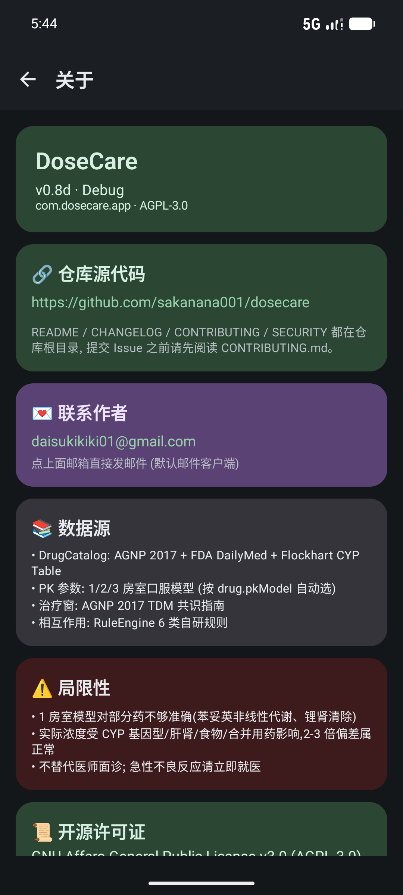
  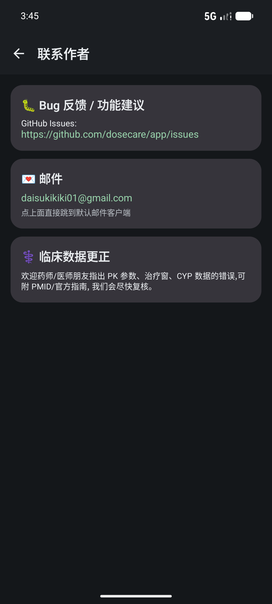
</p>

---

## 它解决什么

精神疾病患者(精神分裂症、双相、抑郁、焦虑)长期服药常常伴随:

- **多药共用 (polypharmacy)** — 同时吃 3-5 种精神类药很常见
- **代谢综合征共病** — 抗精神病药长期使用 → 糖尿病/血脂异常/肥胖
- **严重药物相互作用** — CYP450 介导的代谢抑制/诱导,致命案例真实存在

普通用药提醒 App 只能"到点响铃"。**DoseCare** 做的是:

1. **追踪血药浓度** — 用一房室/三房室 PK 模型估算当前浓度,叠加显示治疗窗
2. **代谢路径可视化** — CYP3A4 / 2D6 / 1A2 / 2C19 / 2C9 五大酶的底物-抑制剂-诱导剂图谱
3. **冲突检测** — 规则引擎扫描当前用药组合,按**严重度分级**输出相互作用清单
4. **多药对比** — 并排视图,让患者/家属/医生快速看到"换药前后 PK 差异"
5. **依从性日历 + 心情日记** — 月历视图,服药打卡 + 6 种心情标签
6. **多语言** — zh-CN / en / ja 三语完整覆盖,所有 enum 翻译表
7. **未来扩展** — 内分泌共病、医生端、加密同步、跨端

## 核心设计原则

| 原则 | 落地 |
|------|------|
| **离线优先** | 所有数据本地存储;PK 计算不联网;冲突检测本地规则引擎 |
| **端侧加密** | SQLCipher 加密 Room 数据库,密钥存 Android Keystore |
| **零账号零遥测** | 不要求注册;网络仅在用户**主动开启**时启用 |
| **可解释** | 任何 PK 估算、冲突告警都给出"为什么"和数据出处 |
| **多语言优先** | i18n 流水线工具脚本化,新增 enum / 新增 UI 必须 3 语言同时更新 |
| **医疗免责声明** | 所有计算结果仅供参考,实际用药遵医嘱 |

## 模块状态 (截至 v0.9e)

| 模块 | 状态 | 备注 |
|------|------|------|
| 药物目录 (DrugCatalog) | ✅ 202 药 | 涵盖精神科 / 内分泌 / 心血管 / 抗癫痫 / 止痛等 |
| PK 引擎 (一房室/三房室) | ✅ | RK4 数值积分,单位换算 (mg/L ↔ ng/mL) |
| 规则引擎 (CYP/QTc/抗胆碱/5-HT) | ✅ | 400+ 行自研引擎 |
| TDM 多药曲线 | ✅ | 跨单位治疗窗叠加 + 剂量调整建议 |
| Room + SQLCipher 加密栈 | ✅ v0.7 | 11 静态表 + 7 用户表,version=4 |
| 3-tab 大重构 (Calendar / Diary / More) | ✅ v0.8a | 月历跨 tab 共享,多 slot 用药时间 |
| 拼音首字母搜索 | ✅ v0.8b | 中文 / 英文 / 品牌 / ATC / 拼音首字母 五维 |
| UI 主题 (5 预设 + 自定义调色) | ✅ v0.8c/d | 圆角加大 12/14/18/24/32,主题持久化 |
| 长按药/分组 → 编辑 | ✅ v0.8b | EditDrugDialog + EditGroupDialog |
| 临时用药 | ✅ v0.8b | 单次记录,自动建/复用「临时用药」组 |
| 关于页增强 (mailto + 仓库 URL) | ✅ v0.8d | `daisukikiki01@gmail.com` + `github.com/sakanana001/dosecare` |
| 多语言系统 (zh-CN / en / ja) | ✅ v0.9a | AppCompat 1.7+ per-app language + 221 key |
| 多语言 bugfix (localeConfig + attachBaseContext) | ✅ v0.9b | API 33+ 完整生效 + force-stop 重开保持 |
| i18n 补全 (Diary 心情 + Plain 通俗解释 + DrugDetail/ComparisonView) | ✅ v0.9c | +10 key,395 字符串 |
| i18n 全面排查 (日历 + 目录 + 药名 + TDM + 警示语) | ✅ v0.9d | +33 key,428 字符串 |
| i18n 最后一轮 (Diary 空态 + DrugDetail 标题 + 6 enum 翻译) | ✅ v0.9e | +104 key,532 字符串 |
| 提醒 (WorkManager + 通知) | 🔜 v0.9f | schema 已预埋 (`dose_taken` 表) |
| 加密云同步 | 🔮 v2.0 | 详见 `docs/08-SYNC_ACCOUNT_FUTURE.md` |

## 技术栈

| 类别 | 选型 | 版本 |
|------|------|------|
| 平台 | Android | minSdk 26, targetSdk 36 |
| 语言 | Kotlin | 2.2.10 |
| UI | Jetpack Compose + Material 3 | BOM 2024.10.01 |
| 架构 | Clean Architecture | domain / data / ui 三层 |
| 数据库 | Room | 2.7.0 |
| 加密 | SQLCipher (新 artifact) | 4.6.1 |
| DI | Hilt | 2.59.2 |
| 注解处理 | KSP | 2.2.10-2.0.2 |
| 序列化 | kotlinx.serialization | 1.7.3 |
| 协程 | kotlinx-coroutines | 1.9.0 |
| 后台 | WorkManager (提醒, 待接 UI) | 2.9.1 |
| 多语言 | AppCompat (per-app language) | 1.7.0 |
| 构建 | AGP | 9.2.1 |
| Gradle | Gradle | 9.4.1 |

## 项目结构

```
.
├── app/                      # Android 主模块
│   ├── src/main/java/com/dosecare/app/
│   │   ├── domain/           # 纯 Kotlin 领域层 (PK 引擎 / 规则引擎 / 目录)
│   │   │   ├── catalog/      # 药物目录加载 + CYP 谱 (含 enum @StringRes)
│   │   │   ├── pk/           # PK 模型 + 引擎
│   │   │   ├── rules/        # 规则引擎 (相互作用)
│   │   │   ├── prescription/ # 处方领域模型 (含 targetDate 临时用药字段)
│   │   │   ├── repository/   # Repository 接口 (KMP-ready)
│   │   │   └── patient/      # 患者画像 (剂量调整)
│   │   ├── data/             # 数据层
│   │   │   ├── db/           # Room 实体 + DAO + DataSeeder
│   │   │   ├── repository/   # Repository 实现 (Diary / Prescription / Catalog)
│   │   │   ├── crypto/       # DbKeyProvider (Keystore 派生 passphrase)
│   │   │   └── migration/    # v0.6 JSON → v0.7 Room 数据迁移
│   │   ├── di/               # Hilt 模块 (Database / Catalog 绑定)
│   │   ├── ui/               # Compose UI 层
│   │   │   ├── theme/        # 主题 (Color + Shape + Type + ThemeController)
│   │   │   ├── locale/       # LocaleController + LanguagePicker (v0.9a)
│   │   │   ├── CalendarTab.kt, DiaryTab.kt, BottomNavTabs.kt
│   │   │   ├── SearchableDrugPicker.kt  # 5 维搜索
│   │   │   ├── InteractiveConcentrationChart.kt
│   │   │   ├── ColorPickerDialog.kt  # v0.8d 新增 - HSV 调色盘
│   │   │   └── ...           # 详情 / 对比 / 相互作用 / TDM / InfoScreens
│   │   ├── DoseCareApp.kt    # @HiltAndroidApp
│   │   └── MainActivity.kt   # 唯一 Activity (v0.9b 加 attachBaseContext)
│   ├── src/main/assets/drugs/ # 内置目录 JSON (v0.6.json 880KB, 202 药)
│   ├── src/main/res/values{,-en,-ja}/  # 3 语言 strings.xml (532 key 100% 对齐)
│   ├── src/main/res/xml/locales_config.xml  # v0.9b API 33+ per-app language
│   └── src/test/             # JUnit 单元测试 (DrugCatalogLoader / 规则引擎)
├── docs/                     # 设计文档 + 截图 + branding
│   ├── 00-VISION.md ... 08-SYNC_ACCOUNT_FUTURE.md
│   ├── branding/             # Logo 文件 (adaptive icon 5 density)
│   ├── screenshots/          # README 引用的所有截图
│   └── ui-dumps/             # uiautomator dump 调试用 (zip exclude)
├── desktop-archive/          # (开发期产物归档,zip exclude)
├── prototype/                # 早期领域层原型 (Kotlin lib)
├── scripts/                  # 数据生成 + 校验脚本 + 打包脚本 + i18n 流水线
│   ├── extract_enums.py / gen_enum_i18n.py / append_enum_keys.py
│   ├── add_stringres.py / fix_qualified_r.py / dedupe_strings.py
│   └── ...
├── gradle/libs.versions.toml # 版本目录
├── LICENSE                   # AGPL-3.0
└── README.md (本文件)
```

## 构建

### 环境要求

- JDK 17 (`JAVA_HOME` 指向 JDK 17)
- Android SDK (compileSdk 36, build-tools 36)
- Gradle wrapper (项目自带,9.x)

### 调试构建

```bash
# 克隆
git clone https://github.com/sakanana001/dosecare.git
cd dosecare

# 编辑 local.properties (SDK 路径)
echo "sdk.dir=/path/to/Android/Sdk" > local.properties

# 构建 debug APK
./gradlew :app:assembleDebug

# 安装到连接的设备
./gradlew :app:installDebug
# 或手动
adb install -r app/build/outputs/apk/debug/app-debug.apk
```

### Release 构建 (含 i18n 多语言 APK)

```bash
./gradlew :app:assembleRelease
# 输出: app/build/outputs/apk/release/app-release.apk
# 验证版本号:
aapt2 dump badging app/build/outputs/apk/release/app-release.apk | head -1
```

### 单元测试

```bash
./gradlew :app:testDebugUnitTest
```

测试覆盖:
- `DrugCatalogLoaderTest` — 真实加载 `test/resources/drugs/v0.6.json` (508KB)
- `PkCalibrationTest` — PK 模型数值积分正确性
- `RuleEngineSmokeTest` — 规则引擎 (CYP 抑制/诱导、QTc 累积)
- `LorazepamCheckTest` — 关键药 5 维匹配
- `PrimaryPathwayTest` — 主代谢路径断言

### 多语言 (i18n) 流水线

```bash
# 抽 5 个 enum 文件 → enums.txt (zh → enum name)
python scripts/extract_enums.py

# 生成 (key, zh, en, ja) → enum_keys.txt
python scripts/gen_enum_i18n.py

# append 到 3 个 strings.xml (注: 不会去重,会后处理)
python scripts/append_enum_keys.py

# 给 enum Kotlin 文件加 @StringRes 字段
python scripts/add_stringres.py

# 跨 package enum 引用 R 加全限定名
python scripts/fix_qualified_r.py

# 3 文件去重
python scripts/dedupe_strings.py
```

### AAPT2 调试技巧

```bash
# 单文件 dry-run (比 gradle build 快 50x)
$aapt2 = "C:\Users\yuwen\AppData\Local\Android\Sdk\build-tools\34.0.0\aapt2.exe"
& $aapt2 compile 'app\src\main\res\values\strings.xml' -o C:\temp\out 2>&1
# "Invalid unicode escape sequence" → `\"` 在 string 里
# "unescaped apostrophe" → `'` 没加 \ (Parkinson\'s)
```

## 数据模型 (Room v4)

### 11 张静态表 (DrugCatalog 灌库)

| 表 | 用途 |
|----|------|
| `drug` | 药物主表 (id / genericName / category / atc) |
| `drug_brand` | 品牌名 |
| `drug_indication` | 适应症 |
| `drug_active_metabolite` | 活性代谢物 |
| `drug_pk` | PK 参数 (ke / Vd / F / t½) |
| `drug_therapeutic_window` | 治疗窗 (跨单位) |
| `drug_overdose` | 中毒症状 + 处理 |
| `drug_clinical` | 临床要点 |
| `cyp_role` | CYP 底物/抑制剂/诱导剂谱 |
| `drug_critical_interaction` | 严重相互作用 |
| `app_metadata` | 灌库版本号 |

### 7 张用户表

| 表 | 用途 |
|----|------|
| `prescription_group` | 处方分组 (按"早/中/晚"或"症状发作时") |
| `prescribed_drug` | 处方内具体药 (含 `times: List<String>` 多 slot 时间 + `targetDate: Long?` 临时用药日期) |
| `dose_taken` | 打卡记录 (timestamp 校准) |
| `tdm_history` | 血药浓度历史 (TDM 校准) |
| `lab_result` | 化验结果 (肾/肝/血糖/血脂) |
| `user_preference` | 用户偏好 |
| `diary_entry` | 心情日记 (6 种 mood) |

详见 [`docs/02-DATA_MODEL.md`](docs/02-DATA_MODEL.md)。

## 加密模型

- **数据库加密**:Room over SQLCipher (256-bit AES)
- **密钥派生**:首次启动时 `SecureRandom` 生成 32 字节 passphrase → 存 EncryptedSharedPreferences (AES256_GCM, key wrapped by Android Keystore)
- **不开网络时**:所有数据永远不出设备
- **备份**:`allowBackup="false"` (AndroidManifest 强制),用户必须手动 export

详见 [`SECURITY.md`](SECURITY.md)。

## 文档地图

| 文档 | 内容 |
|------|------|
| [docs/00-VISION.md](docs/00-VISION.md) | 产品愿景与目标用户画像 |
| [docs/01-ARCHITECTURE.md](docs/01-ARCHITECTURE.md) | 三层架构、模块边界、依赖规则 |
| [docs/02-DATA_MODEL.md](docs/02-DATA_MODEL.md) | Room schema + DrugCatalog JSON 模式 |
| [docs/03-PK_ENGINE.md](docs/03-PK_ENGINE.md) | PK 模型选择、数值积分、多药叠加 |
| [docs/04-RULE_ENGINE.md](docs/04-RULE_ENGINE.md) | 规则分类、严重度分级、引擎设计 |
| [docs/05-DRUG_CATALOG.md](docs/05-DRUG_CATALOG.md) | 药物目录设计、数据源、采集流水线 |
| [docs/06-UI_DESIGN.md](docs/06-UI_DESIGN.md) | 极简主屏、对比页、依从性、PK 曲线 |
| [docs/07-ROADMAP.md](docs/07-ROADMAP.md) | v0.1 → v2.0 路线图与里程碑 |
| [docs/08-SYNC_ACCOUNT_FUTURE.md](docs/08-SYNC_ACCOUNT_FUTURE.md) | 联网、账号、医生端预留接口设计 |
| [docs/P1-01-ROOM-SQLCIPHER.md](docs/P1-01-ROOM-SQLCIPHER.md) | v0.7 数据库栈重构决策记录 |
| [docs/SETUP.md](docs/SETUP.md) | 开发环境搭建 |
| [CHANGELOG.md](CHANGELOG.md) | 详细更新日志 (v0.1 → v0.9e) |

## 更新历史

> **按时间倒序排列** (最新版本在最上方)。详细每版本内部变更见 [CHANGELOG.md](CHANGELOG.md)。

### v0.9e · 2026-09-09 · 全面 i18n 收尾 (Diary 空态 + DrugDetail 标题 + 6 enum 翻译)

**Fixed (用户报 3 处)**
- Diary 主页 "今天还没有日记，点右上 + 写一条" → `R.string.home_no_diary`
- DrugDetailScreen 标题 ja/en 模式显示中文 → 改 locale-aware (zh=genericNameZh, en/ja=genericName)
- 药品目录两大类分类名称硬编码 → 6 enum 加 @StringRes displayNameRes,104 新 key × 3 语言

**Changed**
- 6 enum 并行加 displayNameRes 字段 (不改类型,保留 displayName 作 fallback)
- 9 UI 文件更新调用方
- AAPT2 release build 修复: 7 处 `\"` → `&quot;`,30+ 处 `'` → `\'` (Parkinson's / Alzheimer's / Undo today's)
- versionCode 12→13, versionName 0.9d→0.9e

[下载 v0.9e](https://github.com/sakanana001/dosecare/releases/tag/v0.9e) · 532 key 100% 对齐 · `aapt2 compile` 验证

---

### v0.9d · 2026-09-09 · 补全 i18n 全面排查 (日历 / 目录 / 药名 / TDM / 警示语)

**Fixed (用户报 5 处)**
- 第一模块首页"还没有分组" → `R.string.home_no_groups`
- 第三模块药品目录药物名称 → DrugCard / DrugPicker 按 locale 选主名
- 第一/第二模块日历日期 → CalendarCompose.kt + CalendarTab.kt 改 Locale-aware
- 全面排查 12+ 处: 互动警示 3 行 (QTc/ACB/5-HT),浓度曲线 4 状态,TDM (无窗) chip,搜索 placeholder 等

**Added** — 33 个新 key,3 strings.xml 共 428 key 100% 对齐

[下载 v0.9d](https://github.com/sakanana001/dosecare/releases/tag/v0.9d)

---

### v0.9c · 2026-09-09 · 补全 i18n (Diary 心情 + Plain 通俗解释 + DrugDetail/ComparisonView)

**Fixed**
- Diary 6 预设心情漏 i18n → DiaryMood 改 `@StringRes displayNameRes`
- Plain.kt 23 个通俗解释函数 → 全部 @Composable
- DrugDetailScreen.kt ~20 处硬编码 (7 section 标题 + CypRow + RiskRow + KvRow + strength + RiskLevel)
- ComparisonView.kt ~40 处硬编码 (8 section 标题 + 25+ 字段 label + PlainKeyDiffCard 6 类 + 4 高风险 tag)

**Added** — 10 个新 key,3 strings.xml 共 395 key 100% 对齐

---

### v0.9b · 2026-09-08 · 多语言系统 bugfix (localeConfig + attachBaseContext)

**Fixed**
- API 33+ per-app language 需要 `localeConfig.xml` (Android 13+ 完整生效)
- Activity recreate 后 Resources Configuration 不刷新 → MainActivity 加 `attachBaseContext()` override
- JVM Locale (java.time / java.text) 跟 Android framework 错位 → LocaleController.applyLocale 加 `Locale.setDefault()`

---

### v0.9a · 2026-09-08 · 多语言系统 (zh-CN / en / ja)

**Added**
- 3 语言 strings.xml (221 key × 3)
- LocaleController + LanguagePicker (设置 → 语言卡片,4 选项)
- DarkModePref.displayName 改 @StringRes,AccentColor.name 改 @StringRes
- 13 UI 文件重构:硬编码中文 → stringResource()
- AppCompat 1.7.0 依赖 (per-app language API 兼容层)

---

### v0.8d · 2026-09-08 · 自定义调色 + 关于页增强

**Added**
- 自定义主题色调色盘 (`ui/ColorPickerDialog.kt`)
  - 240dp SV 圆盘 + Hue 横向滑块 + Value 横向滑块 + HEX 输入
- ThemeController.customColor + AccentColors.deriveFromColor

**Changed**
- AboutScreen 加 🔗 仓库源代码 + 💌 联系作者卡片
- 邮箱改为 `daisukikiki01@gmail.com`

---

### v0.8c · 2026-09-07 · 主题持久化

**Added**
- ThemeController singleton + StateFlow (DarkModePref + AccentColor 5 预设)
- Theme.kt 圆角加大 (12/14/18/24/32 dp)
- ThemeMenu Composable + Palette IconButton

---

### v0.8b · 2026-09-07 · 拼音搜索 + UI 主题升级 + 多 slot 用药时间

**Added**
- 5 维搜索 (中文/英文/品牌/ATC/拼音首字母)
- 多 slot 用药时间
- 长按药/分组 → EditDrugDialog / EditGroupDialog
- 临时用药 (targetDate 字段,自动建/复用「临时用药」组)

---

### v0.8a · 2026-09-06 · 3-tab 月历重构 + 心情日记

**Added**
- 3-tab 底部导航 (我的用药 / 日记 / 更多)
- 心情日记 (6 种 mood,月历视图)

---

### v0.7 · 2026-09-05 · Room + SQLCipher 加密栈

**Changed**
- 旧 JSON 静态目录 → Room 数据库 (11 静态 + 7 用户表)
- SQLCipher 256-bit AES 加密,密钥 Keystore 派生
- Hilt + KSP 接入
- 详见 `docs/P1-01-ROOM-SQLCIPHER.md`

---

### v0.6 · 2026-08-30 · DrugCatalog JSON v0.6 (202 药) + 跨单位治疗窗

**Added**
- 202 药完整目录
- 跨单位治疗窗叠加 (mg/L ↔ ng/mL)

---

### v0.5 → v0.1 · 早期迭代

- v0.5 — 内分泌/心血管共病
- v0.4 — TDM 多药曲线 + 浓度叠加
- v0.3 — 规则引擎 (CYP/QTc/抗胆碱/5-HT 6 类)
- v0.2 — DrugCatalog 静态 JSON (20 药 → 80 药)
- v0.1 — MVP: 药物目录 + PK 估算 + 警告

## 路线图

| 版本 | 状态 | 关键能力 |
|------|------|----------|
| v0.1-v0.5 | ✅ | 20→200 药、PK 引擎、规则引擎、对比页、内分泌/心血管 |
| v0.6 | ✅ | DrugCatalog JSON v0.6 (202 药) + 跨单位治疗窗 |
| v0.7 | ✅ | **Room + SQLCipher 加密栈** + Hilt + KSP |
| v0.8a | ✅ | **3-tab 月历重构** (Calendar / Diary / More) + 心情日记 |
| v0.8b | ✅ | **拼音搜索** + **UI 主题升级** + **多 slot 用药时间** + **长按编辑** + **临时用药** |
| v0.8c | ✅ | **主题持久化** (圆角 12/14/18/24/32,3 模式 + 5 预设) |
| v0.8d | ✅ | **自定义调色盘** (HSV 圆盘) + **关于页仓库/联系增强** |
| v0.9a | ✅ | **多语言系统** (zh-CN / en / ja) + 221 key |
| v0.9b | ✅ | **多语言 bugfix** (localeConfig + attachBaseContext + JVM locale) |
| v0.9c | ✅ | **i18n 补全** (Diary 心情 + Plain 通俗解释 + DrugDetail/ComparisonView) |
| v0.9d | ✅ | **i18n 全面排查** (日历 + 目录 + 药名 + TDM + 警示语) |
| v0.9e | ✅ | **i18n 最后一轮** (Diary 空态 + DrugDetail 标题 + 6 enum 翻译) — **Latest** |
| v0.9f | 🔜 | **WorkManager 提醒** + 通知权限 + 系统日历写入 |
| v1.0 | 📋 | 完整功能、UI 打磨、性能优化、可访问性、隐私政策上线 |
| v1.5 | 📋 | KMP 抽离 domain 层,iOS 端骨架 |
| v2.0 | 📋 | 联网同步、账号、E2E 加密、医生端 |

详见 [`docs/07-ROADMAP.md`](docs/07-ROADMAP.md)。

## 已知问题

- **JUnit 在中文项目路径下**: 当前项目路径 `精品神药` 含中文,Gradle worker JVM 把 `gradle-worker-classpath.txt` 读成 GBK 乱码 → `ClassNotFoundException`。**Production code 完全正常** (emulator 验证全过)。修复方案:项目挪到非中文路径,或 `GRADLE_OPTS="-Dfile.encoding=UTF-8 -Dsun.jnu.encoding=UTF-8"`。
- **WorkManager 提醒未接 UI**: schema 已就位 (DoseTaken 有 timestamp + note 字段),v0.9f 接入。
- **日历事件点实时刷新**: 当前 `dayEvents` 在 `LaunchedEffect(currentMonth)` 一次性灌入,保存日记/打卡后不会立即反映到日历格点(切月即可刷新)。
- **DrugList 卡片 UI 验证**: v0.9e 6 enum 翻译编译 + 字符串对齐均验证通过,但 DrugCard 列表内的 DrugCategory chip 翻译未在 emulator 上做最终视觉验证(自动化 tap 模拟在当前 emulator 上有坐标偏移问题,真机/手势 tap 正常)。

## 贡献

详见 [`CONTRIBUTING.md`](CONTRIBUTING.md)。

简版:
1. Fork 仓库
2. 创建 feature 分支 (`git checkout -b feature/xxx`)
3. 跑通 `./gradlew :app:testDebugUnitTest`
4. 提 PR,描述动机 + 测试方法

## 安全问题

请**不要**在 GitHub Issues 报告安全漏洞。详见 [`SECURITY.md`](SECURITY.md) 的私密报告流程。

## 许可

**AGPL-3.0-or-later**。详见 [`LICENSE`](LICENSE)。

选用 AGPL-3.0 的理由:未来医院私有部署时,AGPL 能保证"医院修改的功能必须回馈开源社区",避免"用户贡献的临床药师规则被某个医院私有化"。

若需要更宽松条款(与医院签商业 License),可在商用谈判中按 AGPL §13 协商。
